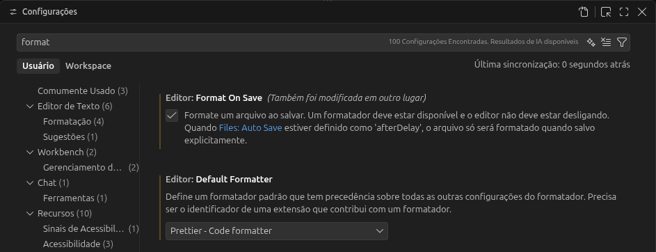

# Configurar o Prettier

Instale o pacote `prettier` como dependência de desenvolvimento:

```bash
npm install prettier -D
```

Na seção `scripts` do arquivo `package.json`, logo após a linha `"dev": "next dev"`, adicione os seguintes scripts:

```json
"lint:check": "prettier --check .",
"lint:fix": "prettier --write ."
```

Após adicionar os scripts, execute-os para verificar e corrigir possíveis problemas de formatação. Primeiro, execute o `lint:check`:

```bash
npm run lint:check
```

Em seguida, execute o `lint:fix`:

```bash
npm run lint:fix
```

Para evitar a necessidade de executar esses scripts manualmente sempre que quiser formatar o código, instale também no VS Code a extensão `Prettier - Code formatter`.

Por fim, nas configurações do VS Code, defina o Prettier como `Default Formatter` e habilite a opção `Format on Save`. Dessa forma, os arquivos serão formatados automaticamente sempre que forem salvos.



Por fim faça o commit das alterações:

```bash
git add -A
git commit -m 'add scripts `lint:check` and `lint:fix`'
git push
```

---

[← Voltar ao sumário](README.md)
