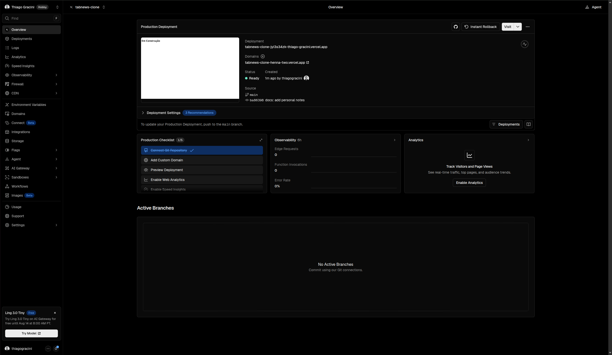

# Hospedagem e deploy

Como estamos utilizando o **Next.js** em nosso projeto, utilizaremos a **Vercel** para realizar a hospedagem e o deploy da aplicação.

Caso ainda não possua uma conta, acesse o site oficial da Vercel e crie uma.

Após criar sua conta, crie um novo projeto e importe o repositório do GitHub referente à nossa aplicação.

Após a importação do repositório, realize o deploy do projeto. Ao final do processo, a configuração na Vercel ficará semelhante à imagem abaixo:

Por fim, adquira um domínio e configure-o na Vercel para que o projeto possa ser acessado diretamente por meio do domínio escolhido.

---

[← Voltar ao sumário](README.md)
