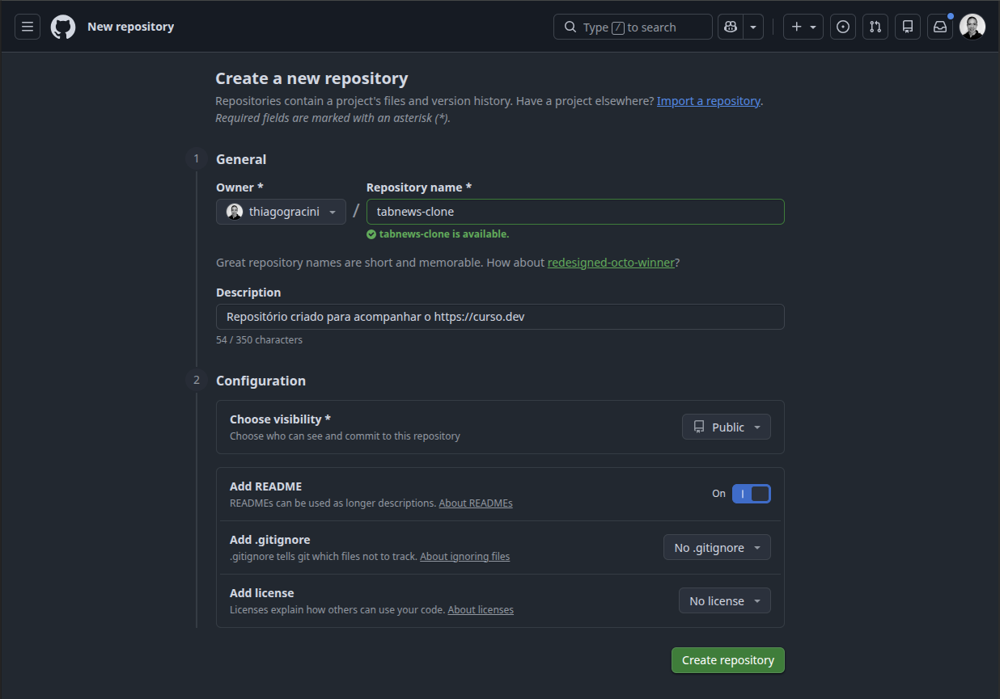

# Repositório

Para começar, a primeira coisa que vamos fazer é criar o nosso repositório, que é, basicamente, o local onde o nosso código ficará armazenado.

Para isso, primeiro vamos criar uma conta no GitHub e, em seguida, criar o repositório com as seguintes configurações:

---

[← Voltar ao sumário](README.md)
